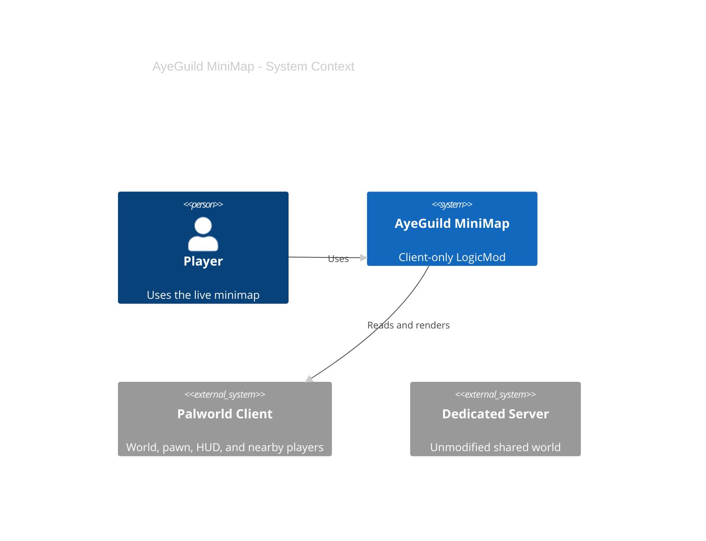
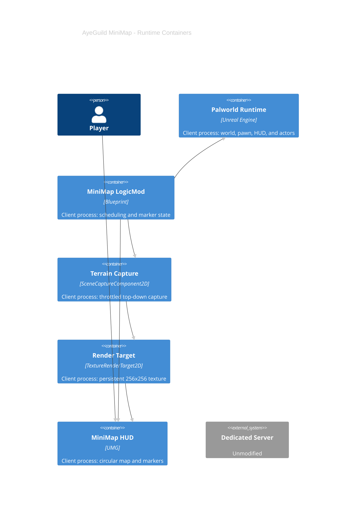
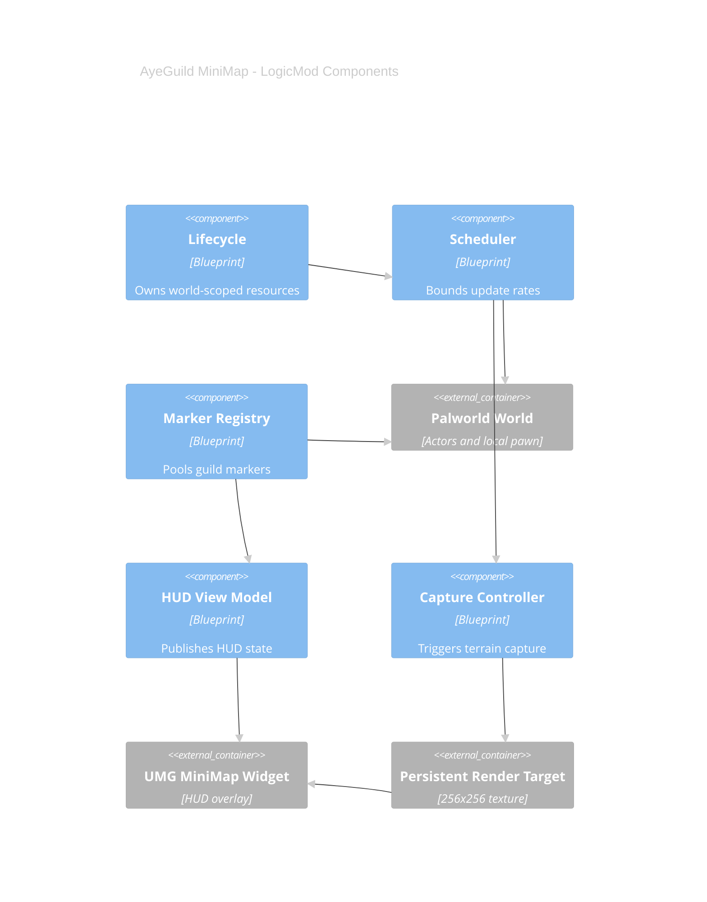
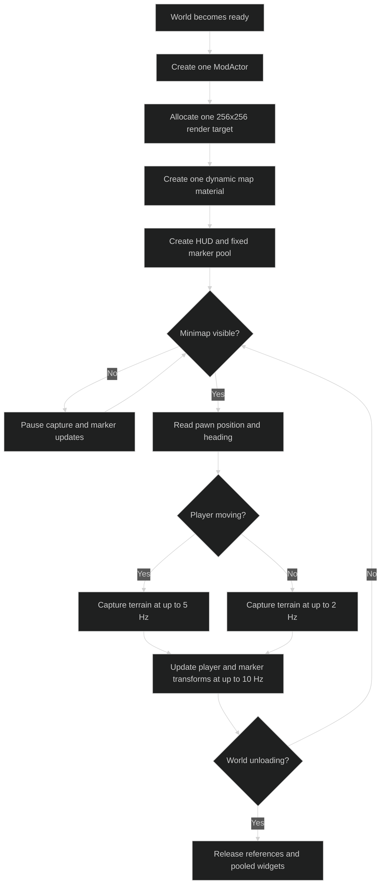
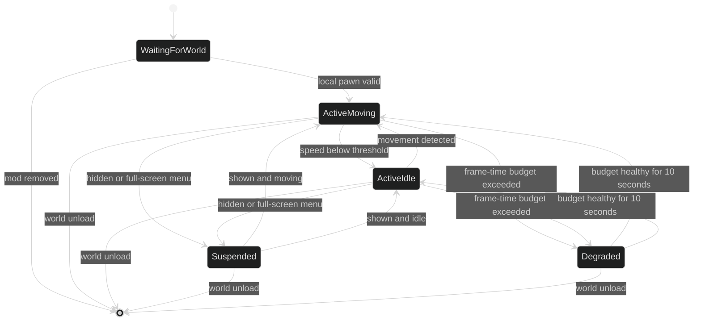
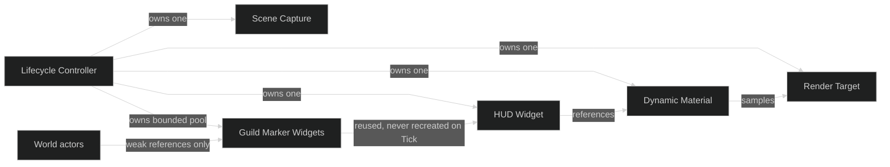
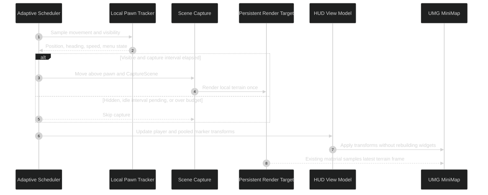
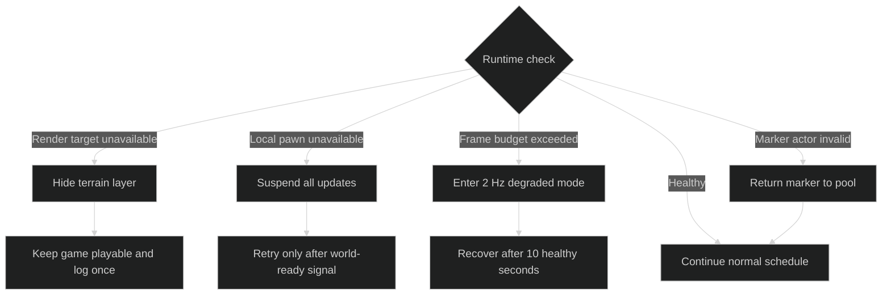

# AyeGuild MiniMap Blueprint Rebuild

> Status: architecture approved; Blueprint implementation and runtime validation
> are pending. The retired UE4SS Lua prototype is not the release design.

The replacement is a client-only Palworld LogicMod. It renders a real local
terrain view, keeps the player visibly centered, and treats smooth frame time as
a release requirement rather than an optional optimization.

## Product Contract

- Circular 256 px local terrain view with no title or permanent label.
- Player arrow stays centered and rotates with heading.
- North-up and heading-up modes.
- Three icon-only zoom levels.
- Nearby guild members use Palworld's native member icon.
- Coordinates are optional and disabled by default.
- Full-screen menus hide the minimap; aiming can hide it by preference.
- No server package, RPC, polling, save-file access, or inventory access.

## C4 Context

## C4 Containers

## C4 Components

## Runtime Flow

## Frame Scheduling

| State | Terrain capture | Marker transforms | Notes |
|---|---:|---:|---|
| Moving | 5 Hz maximum | 10 Hz maximum | Normal exploration |
| Idle | 2 Hz maximum | 4 Hz maximum | Avoids unnecessary GPU work |
| Suspended | 0 Hz | 0 Hz | Menus, hidden map, or world transition |
| Degraded | 2 Hz maximum | 4 Hz maximum | Entered automatically after budget violations |

## Memory Ownership

### Allocation Rules

- Allocate the capture, render target, material, HUD, and marker pool once after
  the local world is ready.
- Nominal render-target storage is 0.25 MiB for one 256x256 RGBA8 surface;
  actual GPU allocation may be higher because of driver alignment.
- Disable mip generation and avoid depth storage unless testing proves it is
  required.
- Never create UObjects, widgets, arrays, materials, or textures on Tick.
- Reuse a fixed marker pool capped at 32 nearby guild members.
- Store weak actor references and remove invalid entries during bounded
  reconciliation.
- Clear strong world references before travel, disconnect, or world teardown.
- Avoid per-frame string formatting; coordinates update only when enabled and
  only when the rounded value changes.

## How Stutter Is Controlled

| Risk | Control | Verification |
|---|---|---|
| Scene capture runs every rendered frame | `bCaptureEveryFrame=false`; explicit adaptive scheduler | UE Insights capture-call count |
| Large render target saturates GPU bandwidth | Fixed 256x256 RGBA8 target; no supersampling | GPU frame-time comparison |
| Actor scans cause CPU spikes | Event-driven registry plus one bounded reconciliation every 2 seconds | Game-thread trace |
| Widgets create garbage | Fixed pool; transform and visibility updates only | UObject count before/after 30 minutes |
| Menus render hidden work | Capture and marker timers pause at zero | Capture-call count while menu is open |
| Teleports create invalid references | World lifecycle hooks clear all cached actors | Repeated travel/disconnect test |
| Too many nearby actors | Guild-only filter and hard cap of 32 markers | Crowded-base stress test |
| Capture cost rises in dense scenes | Minimal show flags; no motion blur, bloom, AO, or post-processing | Dense-base GPU trace |
| Slow hardware misses budget | Automatic degraded state at 2 Hz | Forced low-FPS test |

## Render Pipeline

## Failure and Degradation

The minimap must fail closed: it may hide itself, but it must never block input,
hold stale world references, modify save data, or affect the server.

## Performance Gates

- Less than 3% median FPS loss on the local RTX 3080 test machine.
- Less than 0.5 ms added median game-thread time.
- No recurring frame-time spike above 2 ms attributable to the mod.
- No upward UObject or GPU-memory trend during a 30-minute traversal.
- No capture calls while hidden or while a full-screen menu is open.
- No unbounded actor scan on Tick.
- No server-side files or network calls.

## Visual Gates

- Player movement is obvious within two seconds of walking.
- Terrain beneath the player is recognizable at every zoom level.
- No permanent text in the default configuration.
- Optional coordinate text is at most 13 px.
- No overlap with quests, base status, party list, or weapon controls at
  1920x1080, 2560x1440, and 3840x1440.
- UI scale tests cover 80%, 100%, 120%, and 150%.
- Screenshot verification is required before release.

## Validation Matrix

| Scenario | Required result |
|---|---|
| Walk, sprint, mount, and fly | Terrain follows smoothly; arrow heading is correct |
| Stand idle for five minutes | Capture drops to 2 Hz with no visual jitter |
| Open inventory, map, build menu, and settings | Capture pauses and HUD does not overlap |
| Teleport repeatedly | No duplicate widget, stale marker, or memory growth |
| Join and leave multiplayer | Local-only initialization remains single-instance |
| Gather near 10+ guild members | Marker pool remains bounded and responsive |
| Enter a dense base | Frame-time gates still pass or degraded mode activates |
| Hide minimap for ten minutes | Zero capture and marker update work |
| Remove mod | No save change and no server-side cleanup required |

## Authoring and Release

The current community LogicMod workflow requires:

- Unreal Engine 5.1
- Palworld Modding Kit
- .NET 6
- Visual Studio 2022 with MSVC v143 14.38
- Wwise 2021.1.11

The cooked `.pak`/`.ucas`/`.utoc` output installs through UE4SS LogicMods. The
installer must verify hashes and treat the mod as a private beta until every
performance and visual gate passes.

The architecture was informed by SvenBrnn's MIT-licensed
`pal-yet-another-minimap-mod`. Any reused source assets or Blueprint graphs must
retain its copyright notice and MIT license.
